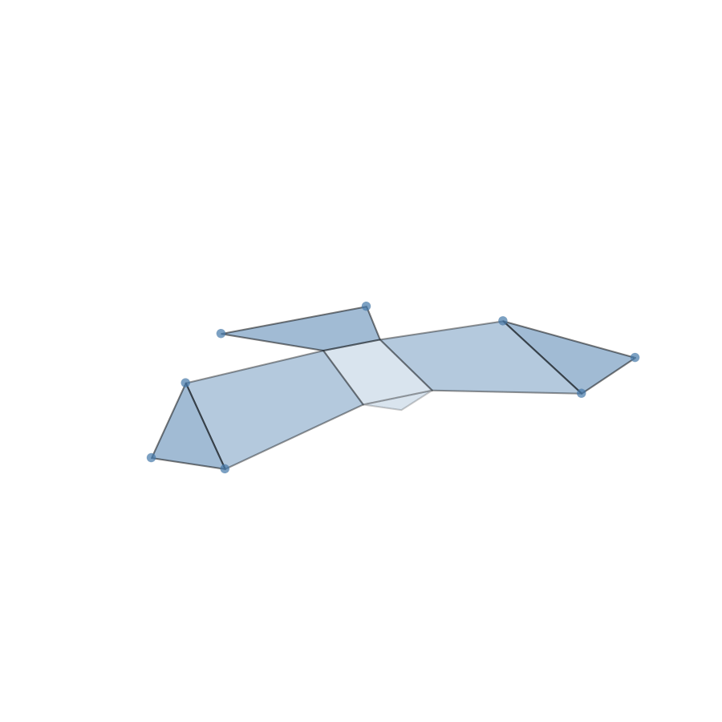
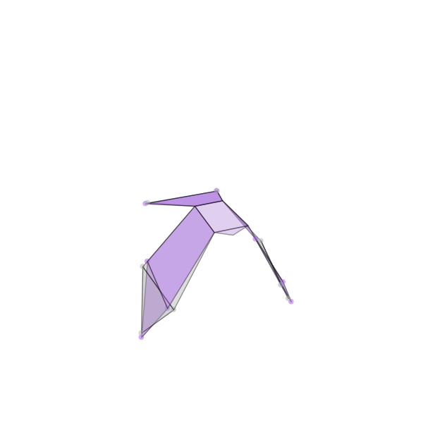
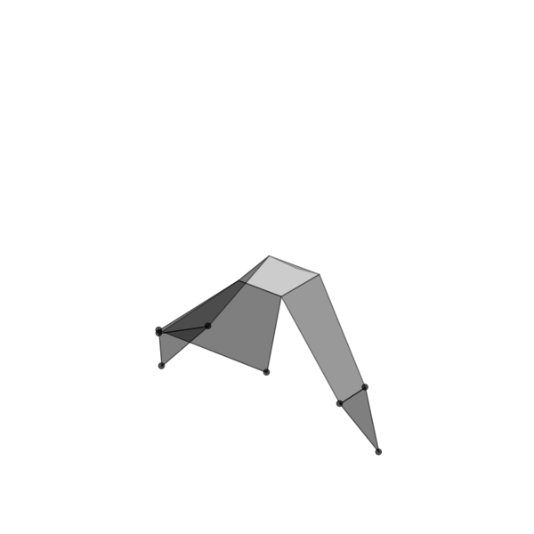
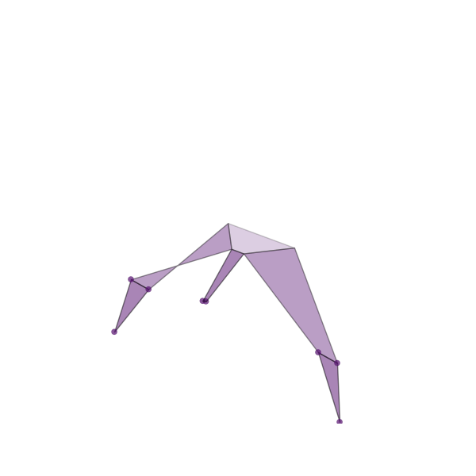
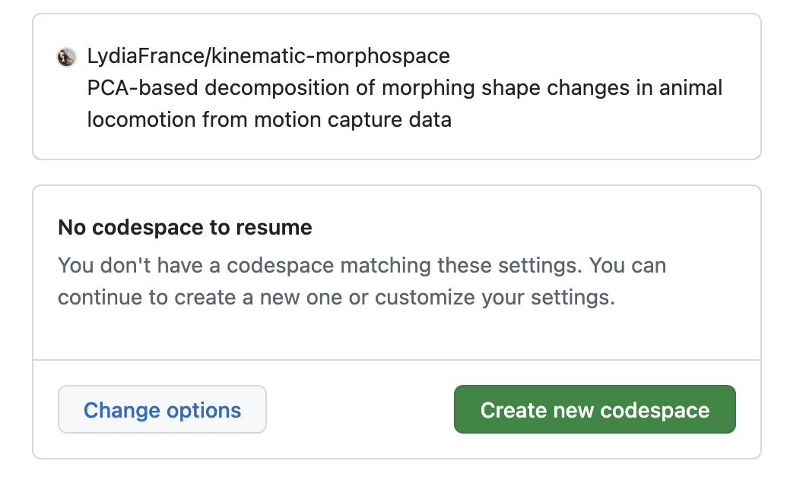
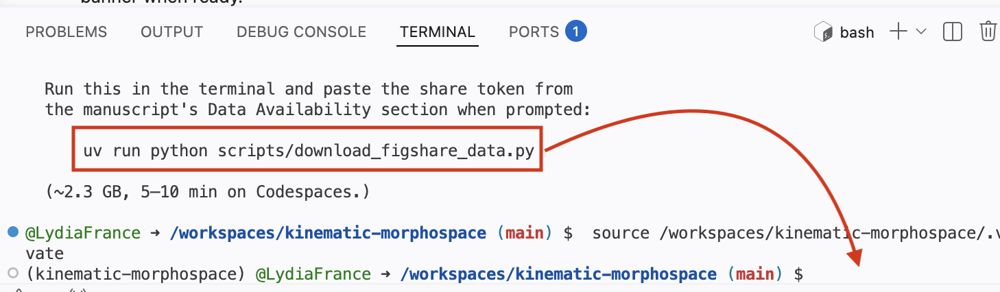
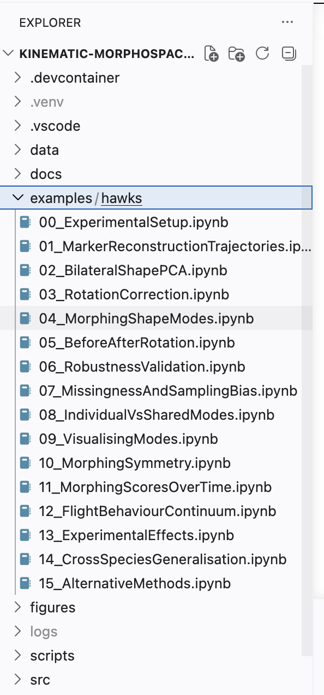
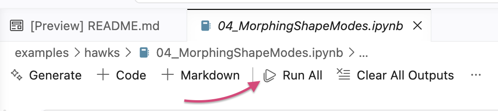

# kinematic-morphospace

<a href="https://doi.org/10.5281/zenodo.19169784"></a>


PCA-based decomposition of morphing shape changes in animal locomotion from motion capture data. Uses data from the wings and tails of 5 Harris' hawks in flights. 

<p align="center">
  
  
</p>
<p align="center">
  <em>Left:</em> Morphing shape mode 4 (tail spreading). <em>Right:</em> 4-mode reconstruction (purple) overlaid on original data (grey).
</p>

<p align="center">
  
  
</p>
<p align="center">
  <em>Left:</em> Harris' hawk wingbeat from motion capture. <em>Right:</em> Same morphing modes projected onto a barn owl morphology (from Harvey 2022 measurements of a cadaver.).
</p>

---

## Reproducing the analysis

An [interactive project page](https://lydiafrance.github.io/LydiaFrance/projects/morphing-wings/) provides an overview of the morphing shape modes without requiring any code to be run.

To reproduce the full analysis, the notebooks can be run either in a browser via GitHub Codespaces (Route A) or on a local machine (Route B).

| Route | Requirements | Setup time |
|---|---|---|
| **A. GitHub Codespaces** | GitHub account | ~5 min |
| **B. Local machine** | [uv](https://docs.astral.sh/uv/) package manager | ~10 min |

The dataset (~2.3 GB) is archived on Figshare under DOI [`10.6084/m9.figshare.32101528`](https://doi.org/10.6084/m9.figshare.32101528). It is currently **embargoed**; access requires a private share token provided in the manuscript's *Data Availability* section. Once the dataset is published the token will no longer be needed.

---

### Route A — GitHub Codespaces

1. Click **[Open in GitHub Codespaces](https://codespaces.new/LydiaFrance/kinematic-morphospace?quickstart=1)**.
   Sign in with GitHub if prompted, then click *Create codespace on main*.

   

2. Wait ~3–5 min for the environment to build. A VS Code editor opens in the browser. The terminal prints a green welcome banner when ready.
3. In the terminal, run:
   ```bash
   uv run python scripts/download_figshare_data.py
   ```
   When prompted, paste the share token from the manuscript's *Data Availability* section (the full `https://figshare.com/s/…` URL also works). The script downloads ~2.3 GB into `./data/` (~5 min on Codespaces).

   

4. Open any notebook under `examples/hawks/`. Click **Run All** to execute.

   
   

   The notebooks can be used in three ways:

   - **Overview** — `04_MorphingShapeModes.ipynb` contains interactive 3D visualisations of the principal morphing shape modes and provides the most direct view of the main results.
   - **Supplementary companion** — each notebook header states which supplementary section it accompanies (e.g. "Supplementary §5"). The corresponding notebook can be run alongside the supplementary materials document.
   - **Sequential** — the notebooks are numbered `00` through `15` and can be run in order from `00_ExperimentalSetup.ipynb` to `15_AlternativeMethods.ipynb`.

> Each notebook begins with a cleanup cell that frees memory from any previous notebook run in the same kernel. This cell is safe to re-run and is a no-op on a fresh kernel.

If the Codespace enters a bad state, it can be deleted from <https://github.com/codespaces> and recreated. Free GitHub accounts include 60 hours/month of 4-core Codespaces.

---

### Route B — Local machine

#### Step 1 — Install [uv](https://docs.astral.sh/uv/)

uv is a single-binary Python package manager. No admin/sudo privileges are required.

<details><summary><b>macOS / Linux</b></summary>

```bash
curl -LsSf https://astral.sh/uv/install.sh | sh
```

Close and reopen the terminal so `uv` is on your `PATH`.
</details>

<details><summary><b>Windows</b> (PowerShell)</summary>

```powershell
powershell -ExecutionPolicy ByPass -c "irm https://astral.sh/uv/install.ps1 | iex"
```

Close and reopen PowerShell.
</details>

Verify the installation:
```bash
uv --version
```

#### Step 2 — Get the code

```bash
git clone https://github.com/LydiaFrance/kinematic-morphospace.git
cd kinematic-morphospace
```

<details><summary>Alternative: download as ZIP</summary>

On the GitHub page, click **Code** → **Download ZIP**, extract, then `cd` into the resulting directory.
</details>

#### Step 3 — Install dependencies

```bash
uv sync
```

This reads `uv.lock` and creates an environment identical to the one used to produce the manuscript figures (~2 min).

#### Step 4 — Download the dataset

```bash
uv run python scripts/download_figshare_data.py
```

When prompted, enter the share token from the manuscript's *Data Availability* section. The script accepts both the bare token and the full URL. Downloads ~2.3 GB into `./data/`. The script is idempotent; already-downloaded files are skipped on re-run.

#### Step 5 — Launch the notebooks

```bash
uv run jupyter lab
```

JupyterLab opens in the browser. `04_MorphingShapeModes.ipynb` provides the most direct overview of the results; `00_ExperimentalSetup.ipynb` is the starting point for a sequential run. Each notebook header states which supplementary section it accompanies.

---

### Share token

The share token is in the manuscript's **Data Availability** section. The share URL ends with a 20-character hex string:

```
https://figshare.com/s/abcdef0123456789abcd
                       └────────┬─────────┘
                            share token
```

Either the bare token or the full URL is accepted by the download script.

---

### Notebook summary

| Notebook | Approximate run time | Description |
|---|---|---|
| `00_ExperimentalSetup` | <1 min | Dataset overview and validation |
| `01_MarkerReconstructionTrajectories` | ~2 min | Marker trajectory visualisation |
| `02_BilateralShapePCA` | ~2 min | Bilateral PCA |
| `03_RotationCorrection` | ~2 min | Body-rotation correction |
| `04_MorphingShapeModes` | ~2 min (PAPER_MODE: ~5 min) | Morphing-shape PCA and permutation tests |
| `05_BeforeAfterRotation` | ~1 min | Effect of rotation correction |
| `06_RobustnessValidation` | ~3–5 min (PAPER_MODE: ~15–25 min) | Permutation and bootstrap robustness |
| `07_MissingnessAndSamplingBias` | ~5 min | Missingness diagnostics |
| `08_IndividualVsSharedModes` | ~2–3 min (PAPER_MODE: ~10–20 min) | Individual vs shared morphing modes |
| `09_VisualisingModes` | ~2 min | Mode visualisation |
| `10_MorphingSymmetry` | ~5 min | Bilateral symmetry analysis |
| `11_MorphingScoresOverTime` | ~3 min | Temporal score profiles |
| `12_FlightBehaviourContinuum` | ~5 min | Flight behaviour continuum |
| `13_ExperimentalEffects` | ~2 min | Experimental-design effects |
| `14_CrossSpeciesGeneralisation` | ~3 min | Cross-species comparison |
| `15_AlternativeMethods` | ~5 min | Comparison with alternative methods |

Run times measured on a 4-core Codespace. Local machines are typically 1.5–2× faster.

Notebooks 04, 06, and 08 include a `PAPER_MODE` flag near the top of their setup cell. The default (`False`) uses fewer permutation/bootstrap iterations for faster execution (~5–10× speedup) while still producing all figures. Set to `True` to reproduce the exact iteration counts used in the manuscript.

---

### Troubleshooting

| Symptom | Solution |
|---|---|
| Windows: *"running scripts is disabled on this system"* | Use the install command as printed, including `-ExecutionPolicy ByPass`. |
| macOS: *"cannot be opened because the developer cannot be verified"* | System Settings → Privacy & Security → Allow. |
| `uv: command not found` after install | Close and reopen the terminal. |
| `uv sync` hangs or times out | A corporate proxy may be blocking connections. The Codespaces route bypasses local network restrictions. |
| Token rejected by Figshare | Ensure there are no leading/trailing spaces. The token is exactly 20 hex characters. |
| Out of memory | The default Codespace has 16 GB RAM. Switch to 32 GB via the *…* menu → *Change machine type*. |

---

## Library API

To use the package as a library on other data:

```bash
uv add kinematic-morphospace
# with plotting extras:
uv add "kinematic-morphospace[plot]"
```

```python
import kinematic_morphospace

data = kinematic_morphospace.load_data("path/to/markers.csv")
markers, frame_info = kinematic_morphospace.prepare_marker_data(data)
scaled, scaler = kinematic_morphospace.scale_data(markers)
rotated = kinematic_morphospace.undo_body_rotation(scaled)
pca_model, scores = kinematic_morphospace.run_PCA(rotated)
reconstructed = kinematic_morphospace.reconstruct(pca_model, scores, n_components=4)
kinematic_morphospace.plot_explained(pca_model)  # requires [plot] extra
```

Tests (from a clone):
```bash
uv sync --extra test
uv run pytest tests/
```

## Contributing

See [CONTRIBUTING.md](CONTRIBUTING.md).

## Licence

Distributed under the terms of the [MIT licence](LICENSE).

<!-- prettier-ignore-start -->
[actions-badge]:            https://github.com/LydiaFrance/kinematic-morphospace/workflows/CI/badge.svg
[actions-link]:             https://github.com/LydiaFrance/kinematic-morphospace/actions
[pypi-link]:                https://pypi.org/project/kinematic-morphospace/
[pypi-platforms]:           https://img.shields.io/pypi/pyversions/kinematic-morphospace
[pypi-version]:             https://img.shields.io/pypi/v/kinematic-morphospace
<!-- prettier-ignore-end -->
